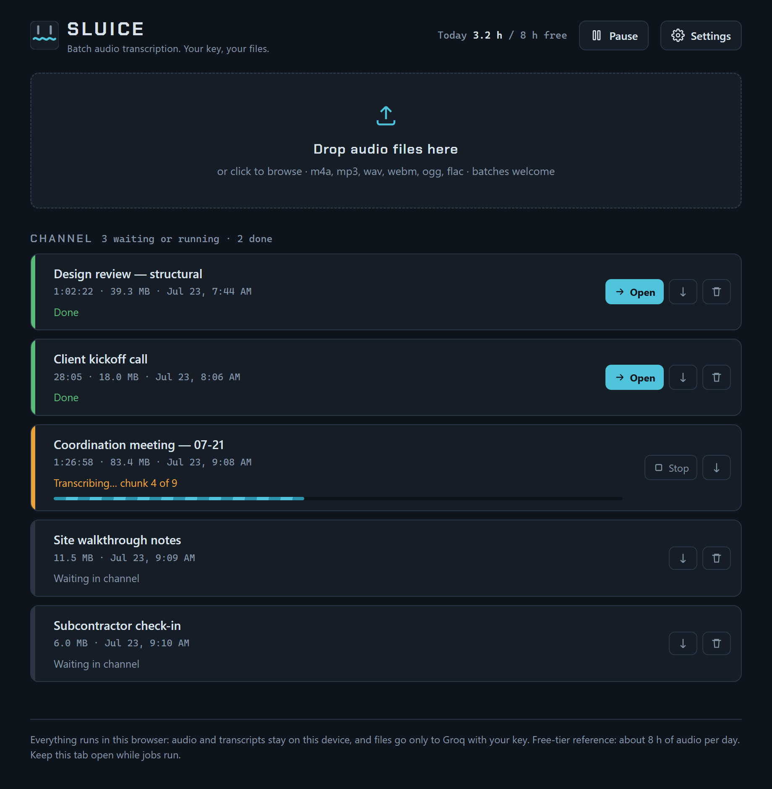
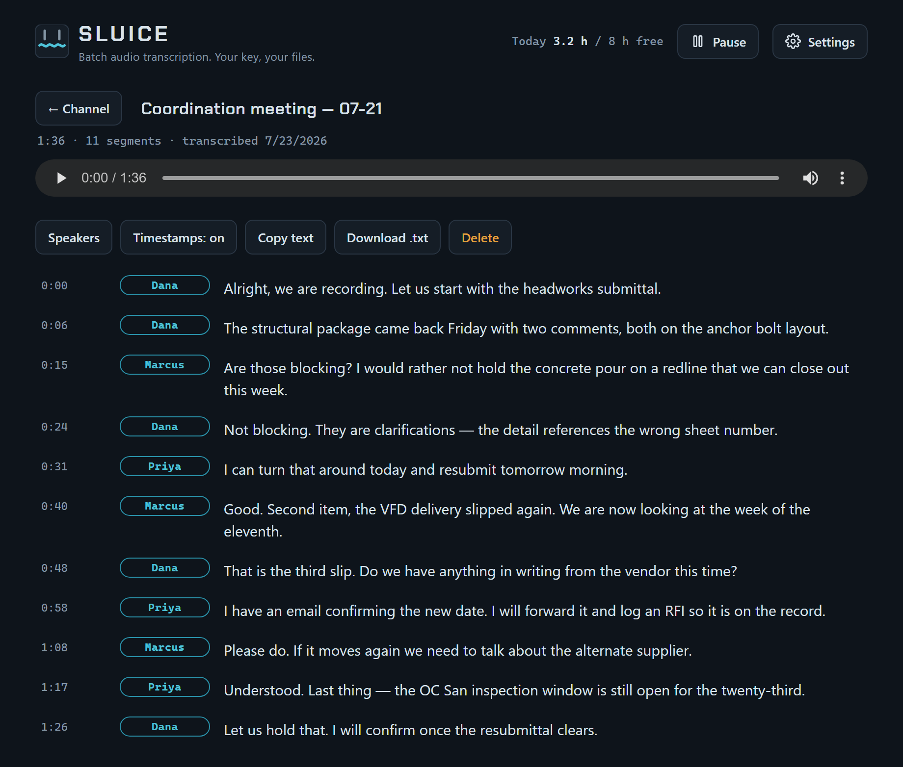

# Sluice

Sluice is a lightweight, standalone, single-file HTML batch transcription tool — a self-hosted alternative to services like TurboScribe, built for absolute privacy and zero-friction deployment.

Drop a folder's worth of recordings into the channel, walk away, and come back to editable transcripts. Your audio never touches a server you don't control: files go directly from your browser to Groq using **your own API key**, and nothing else leaves the machine.

**Live app:** [mds08011.github.io/sluice](https://mds08011.github.io/sluice/)

## Core Features

- Single `.html` file with vanilla JavaScript and inline CSS — no frameworks, no build step, no dependencies to install, no backend to run
- **Bring your own key.** A free Groq API key is the only credential involved, and it is stored in this browser's `localStorage` — never transmitted anywhere except to Groq
- **Batch by default.** Drag in a dozen recordings at once; they queue and process sequentially, unattended
- **Survives a refresh.** The queue and its audio live in IndexedDB, so closing the tab mid-batch doesn't lose the work — interrupted jobs are re-queued on next load
- **Automatic handling of long recordings**, re-encoding and splitting oversized files so uploads stay under Groq's limit, then stitching the results back together (see [Long Recordings](#long-recordings-30-minutes-and-up))
- **Rate-limit aware.** A 429 produces a visible countdown and an automatic resume rather than a failed job
- **Daily usage tracker** against the Groq free tier's ~8 h/day audio reference
- **Transcript editor** with per-segment editable text, click-a-timestamp-to-seek audio playback, and manual speaker labelling with global rename
- Export to `.txt` with optional timestamps and speaker grouping, copy to clipboard, or download the original audio back out

## How to Use

### 1. Get a Groq API key

Groq's Whisper endpoint has a free tier that is generous enough for ordinary use (roughly 8 hours of audio per day).

1. Go to [console.groq.com/keys](https://console.groq.com/keys) and create an account
2. Open **API Keys** → **Create API Key**
3. Copy the key (it starts with `gsk_`) — you only get to see it once

### 2. Open Sluice

Either visit the hosted page at **[mds08011.github.io/sluice](https://mds08011.github.io/sluice/)**, or download `index.html` from the [latest release](https://github.com/mds08011/sluice/releases) and open it directly from your disk. Both run identically; there is no server component either way.

Open **Settings**, paste your key, and press **Test** to confirm Groq accepts it. Save.

### 3. Drop your recordings

Drag audio files onto the channel — or click to browse. Accepted formats are whatever your browser can decode, which in practice means `m4a`, `mp3`, `wav`, `webm`, `ogg`, `opus`, `flac`, `aac`, and the audio track of `mp4`.

Jobs run one after another. **Keep the tab open while the queue runs** — this is a browser app, so a closed tab means a paused queue. You can **Pause** between chunks, **Stop** a running job, and **Retry** anything that errored.

### 4. Edit and export

When a job finishes, click its name to open the transcript.

Every line is editable in place. Click a timestamp to jump the audio there, and click the chip beside a line to cycle through your speakers — add and rename them under **Speakers**, and a rename updates every line at once. **Copy text** and **Download .txt** both respect the timestamp toggle and group consecutive lines by speaker.

### Related Settings

| Setting | What it does |
| --- | --- |
| **Model** | `whisper-large-v3` is the most accurate and the default. `whisper-large-v3-turbo` is faster and cheaper against your rate limit, at some cost in accuracy. |
| **Chunk length** | How long each uploaded piece of a long recording is (5–12 minutes, default 10). Lower this if you hit a `413`. |
| **Language** | Leave blank to auto-detect, or give a code like `en` to skip detection and avoid the occasional wrong-language transcript. |
| **Jargon / vocabulary hint** | Free text passed to Whisper as a prompt. Project names, acronyms, and technical terms spelled correctly here tend to come back spelled correctly in the transcript. |

## Long Recordings (30 minutes and up)

Groq caps uploads at 25 MB, which a two-hour meeting blows past many times over. Sluice handles this without asking you to pre-split anything:

1. **Optimize.** The file is decoded and re-encoded to mono 16 kHz 16-bit WAV. Whisper downsamples to 16 kHz internally anyway, so this discards no useful information — but it shrinks a typical recording by an order of magnitude.
2. **Chunk.** If the result is still longer than your chunk length, it's split into segments with **8 seconds of overlap** at each boundary, so a word straddling the seam is never cut in half. Chunk length is capped so the worst-case upload lands around 22 MB, comfortably under the 25 MB limit.
3. **Stitch.** Each chunk's segments are shifted back to absolute timestamps and reassembled. Lines that fall inside an overlap region are recognised as duplicates and dropped, so you get one clean transcript rather than a stutter every ten minutes.

The queue reports which chunk it's on throughout. A two-hour recording is typically a dozen requests.

## Privacy

Everything except the transcription request itself happens on your device.

- **Audio never goes to any server other than Groq.** There is no backend, no analytics, no telemetry, no error reporting, and no third-party scripts.
- **Your API key is stored only in this browser's `localStorage`.** It is sent as an `Authorization` header to `api.groq.com` and nowhere else.
- **Audio and transcripts are stored in IndexedDB on this device**, and are deleted when you remove a job. Clearing site data removes everything.
- The only outbound request the page makes at load time is the Google Fonts stylesheet, purely cosmetic — **block it, go offline, or open the file from disk and the app works identically**, just in a fallback typeface.

What Groq does with audio you send is governed by their terms, not by this app. If that matters for your recordings, read them.

## Local Execution

Sluice runs perfectly from `file://`. Download `index.html`, double-click it, and it works — IndexedDB, drag-and-drop, playback and all. Network access is only needed for the Groq API call itself.

This makes the file easy to keep alongside the recordings it processes: a copy on a USB stick or in a project folder is a complete, self-contained installation that will still open in ten years.

## Troubleshooting

**"Invalid API key (401)"** — The key is wrong, was revoked, or has stray whitespace. Re-copy it from [console.groq.com/keys](https://console.groq.com/keys) and use **Test** in Settings to confirm before re-queueing. Fix the key, then press **Retry** on the job.

**"Upload too large (413)"** — A chunk exceeded Groq's 25 MB cap. Lower **Chunk length** in Settings (try 5 minutes) and press **Retry**. This is rare, since chunks are sized to land around 22 MB.

**Rate limited (429)** — Expected on the free tier, and handled: the job displays a countdown and resumes automatically, retrying up to nine times with increasing backoff. If you exhaust the retries, you've hit the daily limit rather than the per-minute one — wait for the window to reset and press **Retry**. The usage readout in the header is a rough guide to where you stand.

**"Could not decode this file in the browser"** — The file uses a codec your browser can't decode. This is most common with obscure `.wma`, DRM-protected recordings, and some phone-recorder `.amr` files. Convert to `m4a` or `wav` first (ffmpeg: `ffmpeg -i input.amr output.m4a`). Note that Sluice decodes with the *browser's* codec support, not Groq's, so a file Groq would accept can still fail locally.

**"This browser blocked local storage (IndexedDB)"** — Private/incognito windows and strict privacy settings disable IndexedDB. Use a normal window. Sluice requires it to queue files at all.

**The queue vanished / jobs came back as "Interrupted"** — Browsers evict site storage under disk pressure. Sluice requests persistent storage on load, but the browser may decline. Long-term, export transcripts you care about rather than treating the queue as an archive.

**Very long recordings (2 h+) freeze or crash the tab** — Decoding audio is memory-hungry: the browser holds the fully decoded PCM in RAM, which for two hours of 48 kHz stereo is several gigabytes before the 16 kHz copy is even made. **Use desktop Chrome or Edge for anything past about two hours** — they have the most headroom. Mobile Safari in particular will kill the tab well before that. If a long file won't process, split it in half with any audio editor and queue both halves.

**Transcription is running but the tab is in the background** — Browsers throttle background tabs, which slows the queue but doesn't break it. Leave the window visible for best throughput, and don't close it.

## Roadmap

Speaker diarization is deliberately **not** in v1. Speaker labels are manual: assign them from the chip beside each line, and renaming a speaker updates every line at once. Automatic diarization is the main thing under consideration, in roughly this order of preference:

- **In-browser diarization** via transformers.js / ONNX (a pyannote-style segmentation model running client-side). Experimental, and attractive precisely because it would keep the no-backend, nothing-leaves-the-device property intact.
- **LLM-based speaker-turn inference** using Groq's chat models — feeding the transcript back through a fast model to infer turn boundaries. Cheap and easy with the key you already have, but it guesses from text alone and never actually hears the voices.
- **Optional alternate BYOK backends** such as AssemblyAI or Deepgram, which offer real diarization server-side. This would stay strictly opt-in: a different key in Settings, same single-file app.

## Versioning and Releases

Releases are tagged `vN.N` and published from GitHub Actions, with `index.html` attached as a downloadable asset. Grab the file from the [releases page](https://github.com/mds08011/sluice/releases) for a pinned version, or use the hosted page to always run the latest.

## Technical Specifications

| | |
| --- | --- |
| **Stack** | One HTML file. Vanilla JS, inline CSS, no dependencies, no build |
| **Transcription** | Groq `whisper-large-v3` / `whisper-large-v3-turbo`, `verbose_json`, `temperature=0` |
| **Audio pipeline** | Web Audio `decodeAudioData` → `OfflineAudioContext` resample to mono 16 kHz → pure-JS 16-bit PCM WAV encoder |
| **Chunking** | Configurable 5–12 min, 8 s overlap, absolute-timestamp stitching with overlap dedup |
| **Persistence** | IndexedDB (`sluice` → `jobs`, `audio`) for the queue; `localStorage` for settings and the daily usage counter |
| **Browsers** | Any modern browser with Web Audio and IndexedDB. Desktop Chrome or Edge recommended for recordings over ~2 h |

## License

Sluice is released under the **GNU General Public License v3.0**. See [LICENSE](LICENSE) for the full text.

In short: you may use, study, modify, and redistribute it freely, but derivative works must also be released under the GPL-3.0.
